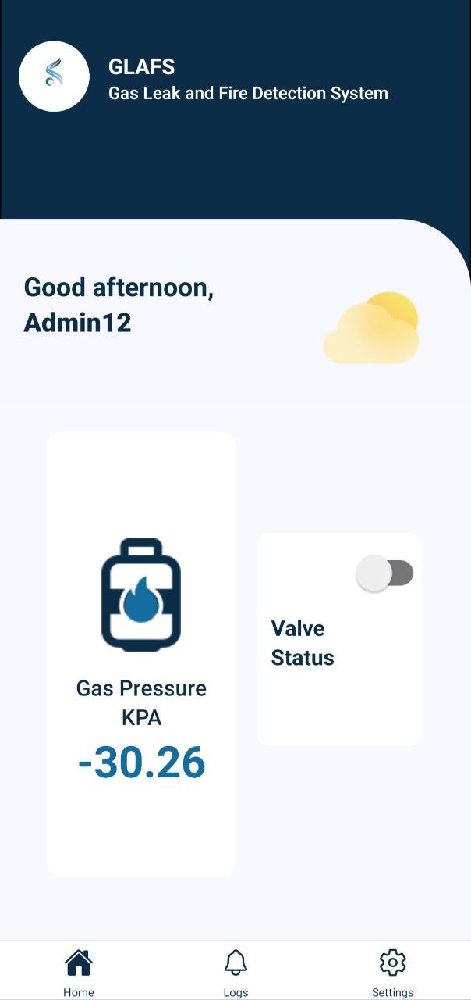
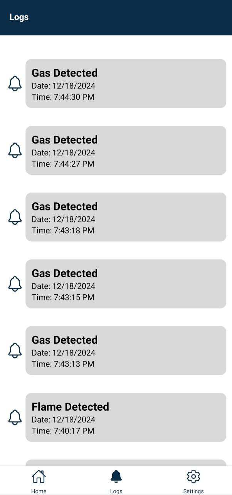
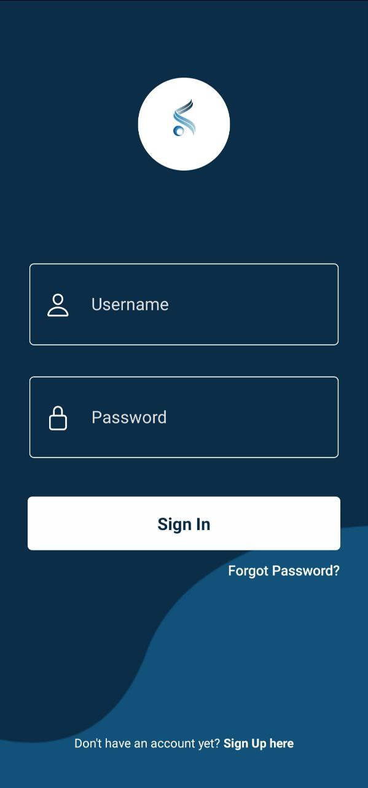
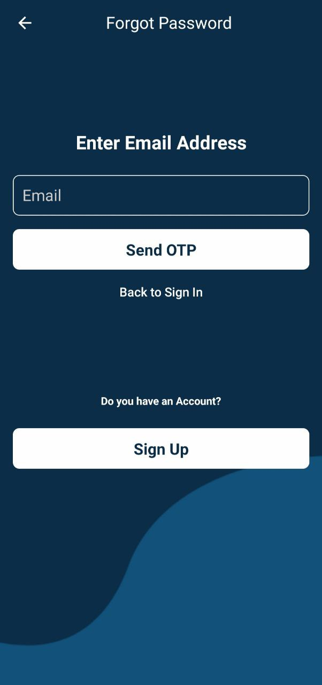
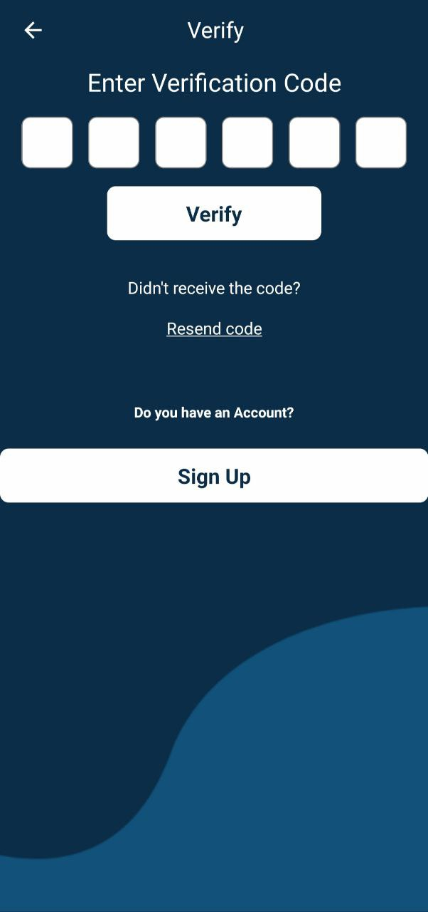
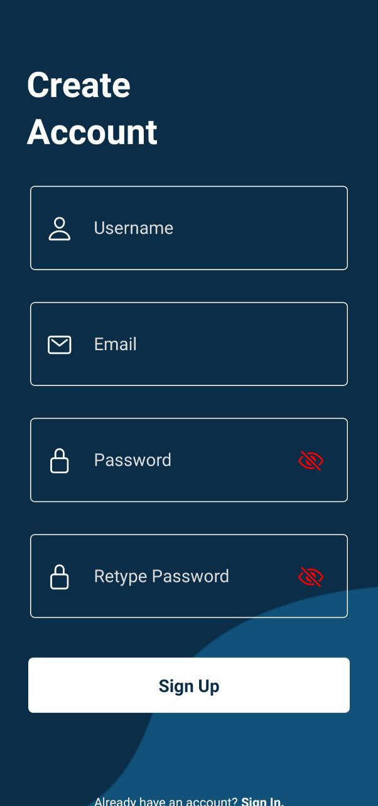

# 🔥 GLAFS – Gas Leak Alarm and Fire System

**GLAFS** (Gas Leak Alarm and Fire Safety) is a **mobile and web-integrated application** designed to **detect**, **log**, and **respond** to gas leaks and fire hazards in real-time. It also allows **remote control of LPG valves**, enhancing home and workplace safety.

---

## 🚀 Features

- **Gas Leak & Fire Detection**  
  Automatically detects hazardous levels of gas or fire using sensors.

- **Event Logging**  
  Every detection is recorded with time, date, and status for traceability.

- **Remote LPG Control**  
  Users can enable or disable the LPG valve remotely through the app.

- **Real-time Alerts**  
  Sends notifications and alerts when danger is detected.

- **User-friendly Interface**  
  Intuitive mobile UI designed for quick actions during emergencies.

---
## 📸 Screenshots

| Home Screen | Event Log | Login |
|-------------|------------------|-----------|
|  |  |  |

| Forgot Password | Verify | Register |
|----------------|----------------|--------|
|  |  |  |
